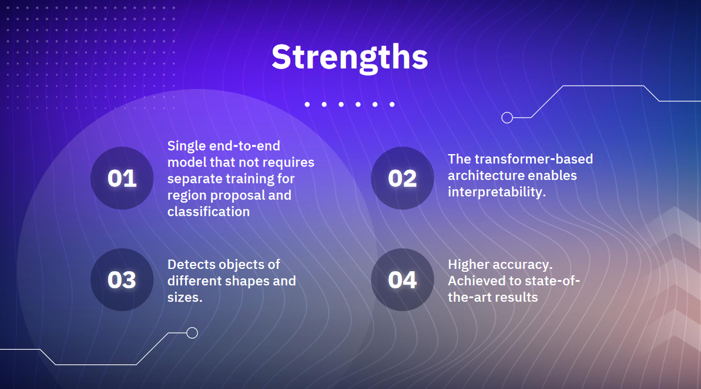

# End-to-end object detection with transformers

🔍 DETR is an innovative method for object detection in computer vision. It does things differently by using transformers, which were popularized in language processing. The authors, Nicolas Carion et al., came up with a clever way to get rid of the usual steps like anchor boxes and non-maximum suppression. Instead, DETR streamlines the process and achieves impressive results.

🎯 What's cool about DETR is that it can recognize and locate objects all in one go. By treating object detection as a set prediction problem, it becomes more efficient. The paper shows that DETR performs really well on well-known datasets like COCO, even better than traditional methods. It's accurate and gets the job done.

🌐 DETR is also versatile. It can work with different types of objects and across different areas, like self-driving cars and factories. It doesn't need a lot of adjustments or fine-tuning for specific datasets, which makes it super useful.

🧠 The secret to DETR's success lies in something called self-attention. It helps DETR understand the relationships between different parts of an image. This means it can handle objects with unusual shapes, obstacles, or size differences. It's a big step forward for computer vision.

### DETR Paper Notes

In this repository, I have summarized the crucial aspects of the paper.

